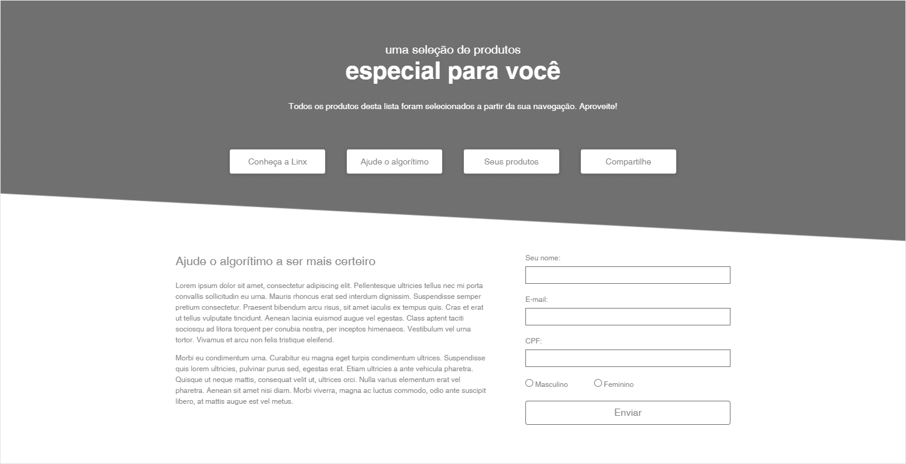

# Desafio | Frontend Developer



Este projeto pode ser testado em [https://bberel-frontend-dev-challenge.herokuapp.com/src/](https://bberel-frontend-dev-challenge.herokuapp.com/src/)

## Tabela de conteudos

- [Sobre o projeto](#Sobre)
- [Setup](#Setup)
- [Funcionalidades](#Funcionalidades)

## Sobre o projeto

- Projeto para avaliação de desenvedor front end da Linx e pode ser consultado em [CHALLENGE](CHALLENGE.md)

Consiste em uma landing page com uma grade de produtos e um formulário de *newsletter* construida utilizando html, css e javascript e conceitos de front end como responsividade.

## Setup

Para melhor interação é recomendado utilizar [git](https://git-scm.com/) e [npm/nodejs](https://nodejs.org/en/) ou [yarn](https://yarnpkg.com/)

1. Clonar o repositorio.

 ``` script
 git clone https://github.com/bberel/frontend-developer-challenge.git
 ```

2. Instalar as dependencias.

 ``` script
 yarn add ou npm install
 ```

3. Servir a aplicação.

 ``` script
 npm start
 ```

Agora poderá fazer alterações no codigo e validar o funcionamento através de um navegador em [http://localhost](http://localhost)

## Funcionalidades

- html, css e javacsript semânticos
    - web
    - mobile
    - e-mail (não implementado :no_entry_sign:)
- produtos consultados via api
- buscar mais produtos
- validação
